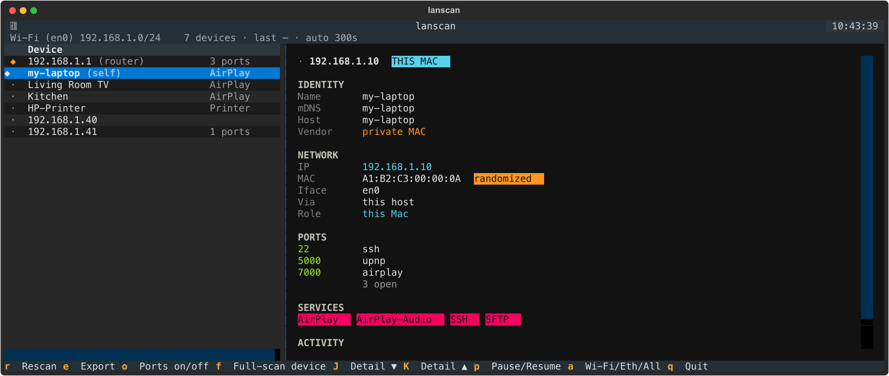

# lanscan

[](https://github.com/lucasdaddiego/lanscan/actions/workflows/ci.yml)

Discover the devices connected to your local network — a live terminal UI with a
**master/detail** split: a compact device list on the left, and full per-device
detail on the right (MAC, vendor, hostname, the services each device advertises,
and the TCP ports it has open). Works on your Wi-Fi and any plugged-in Ethernet.

No root required, no `nmap`/`arp-scan` needed — it shells out to `ping`, `arp`,
and uses mDNS/Bonjour for identification. **macOS only**; intended for networks
you own or are authorised to scan.



## Usage

```sh
make install     # one-time: venv, deps, vendor DB, PATH symlink
make run         # launch the TUI   (after `make install`: just `lanscan`)
```

It's a live TUI — there's no one-shot mode. To get a snapshot, press `e` inside
the TUI to export the current device list to a timestamped `lanscan-*.json` in
the working directory.

Useful flags: `--interface en0`, `--kind wifi|ethernet`, `--no-resolve`
(skip reverse DNS), `--no-mdns`, `--no-ports`, `--timeout 1.0`, `--interval 30`,
`--update-vendors`.

### Keys (TUI)

| Key | Action |
|-----|--------|
| `r` | Rescan now |
| `e` | Export current list to a timestamped JSON file |
| `o` | Toggle the per-device open-port scan |
| `f` | Full-scan (1–65535) the selected device, gently — press again to cancel |
| `p` | Pause / resume auto-refresh |
| `a` | Cycle interface scope: All → Wi-Fi → Ethernet |
| `q` | Quit |

New devices since the last sweep are marked with a green `●`. Footer entries are
clickable, so `e` doubles as an on-screen export button.

## How it works

1. **Interfaces** — `networksetup`/`ifconfig` enumerate the active Wi-Fi and
   Ethernet ports. Virtual networks are excluded by rule, not by luck: bridge
   member interfaces, virtual-interface names (`bridge*`, `vmenet*`, `utun*`, …)
   and any subnet owned by a bridge are all skipped — so OrbStack/Docker/VM
   networks (e.g. `192.168.97.0/24`) and their containers never get swept.
   Re-checked every cycle, so a plugged-in Ethernet adapter appears on its own.
2. **Sweep** — a concurrent ICMP ping sweep of the subnet (subnets larger than a
   /22 are skipped — the status bar flags them). Every reachable host must answer
   ARP, so reading the ARP table afterwards yields IP↔MAC for all of them. A light
   TCP-connect probe mops up the rare hosts that ignore ICMP.
3. **Identify** — reverse DNS for hostnames; mDNS/Bonjour (`zeroconf`) for
   friendly names and advertised services (AirPlay, Chromecast, printers, SSH…);
   OUI lookup for the hardware vendor.
4. **Ports** — a TCP connect scan of a curated ~50 common LAN/IoT/media/dev/admin
   ports per device (a port counts as open only when the handshake completes; no
   root). Curated rather than a full 1–65535 sweep on purpose: a full sweep is
   slow and, at high concurrency, trips routers' / IoT flood-protection and
   corrupts results. On by default — toggle with `o`, or disable with `--no-ports`.
   For a full 1–65535 sweep of a *single* device, select its row and press `f`:
   it runs **gently** (low concurrency, ~128 workers) so it won't trip that
   protection, shows progress, merges into the curated result, and is cancellable
   (press `f` again). Robust hosts finish in seconds; hosts that drop closed ports
   can take minutes.

Randomised/private MACs (the locally-administered bit — common on modern phones)
are labelled as such rather than guessed.

## Vendor names

`make install` downloads the full IEEE/Wireshark `manuf` database (~1–2 MB,
public data) so vendors resolve out of the box, cached offline thereafter. To
refresh it later run `make vendors`. Without it, a small built-in map covers
common vendors and the rest show `?`.

## Requirements

macOS, Python 3.14, and [`uv`](https://docs.astral.sh/uv/) (`brew install uv`).
`make install` creates `.venv`, installs the deps (`textual`, `zeroconf`,
`ifaddr`, `platformdirs`), fetches the vendor DB, and symlinks `lanscan` into
`~/.bin` — add that to your `PATH` to run `lanscan` from anywhere (otherwise use
`make run`). Manual equivalent:

```sh
uv venv --python 3.14 .venv
uv pip install -e .
```

## Extending the scan

The package is split so new capabilities slot in cleanly:

- `net.py` — interface discovery & subnet math
- `engine.py` — the async liveness sweep + ARP/DNS/vendor merge
- `discovery.py` — mDNS/Bonjour (add service types to `_LABELS`)
- `vendors.py` — MAC → vendor
- `tui.py` — the Textual app
- `models.py` — the `Device` / `Interface` records

Natural next steps: HTTP-banner identification (use open web ports to name
unknown devices), SSDP/UPnP discovery, persistent device history across runs, or
alerts when an unknown device joins.

## Development

The test suite is hermetic — every shell-out (`ping`/`arp`/`ifconfig`/`networksetup`/
`route`), socket, and mDNS browse is mocked — so it needs no root, no LAN, and no
macOS, and runs in seconds. 100% line **and** branch coverage is enforced.

```sh
make dev      # install the test deps (pytest, pytest-asyncio, coverage) into .venv
make test     # run the suite — fails if coverage drops below 100%
make lint     # ruff
```

GitHub Actions runs the same suite plus ruff on every push and PR, on Python 3.14
(Linux + macOS). See `.github/workflows/ci.yml`.

## License

[MIT](LICENSE) © Lucas Daddiego
